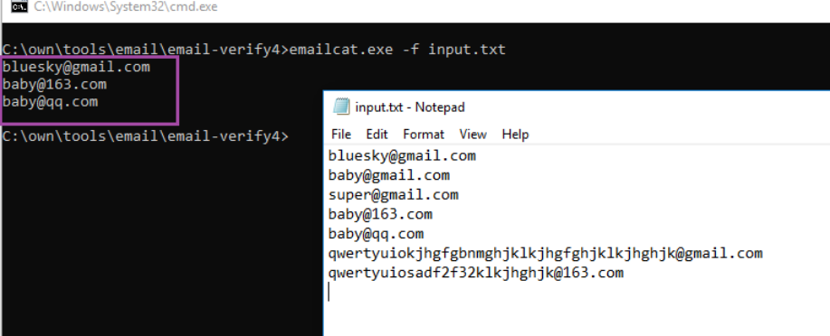

# 简介

在信息收集阶段拿到了很多邮箱，有一些已经弃用，有一些是错误的，所以需要验证其有效性。

本工具使用smtp协议对邮箱的有效性进行验证，默认线程设置为2是出于实战经验，见过的最厉害的邮件服务器在线程数大于2时直接不给响应了，这里也不需要快，主要看的是准确率。

注意事项：本地运营商可能会封禁25端口的smtp协议的报文，应该是出于防垃圾邮件和诈骗邮件等的考虑。若本地网络无法验证，可尝试在vps上运行。（虽然vps供应商也有类似的封堵）

# 帮助

```
C:\own\tools\email\email-verify4>emailcat -h
Usage of emailcat:
  -f string
        email address file (default "input.txt")
  -p string
        smtp port (default "25")
  -t int
        thread number (default 2)
```

# 例子

